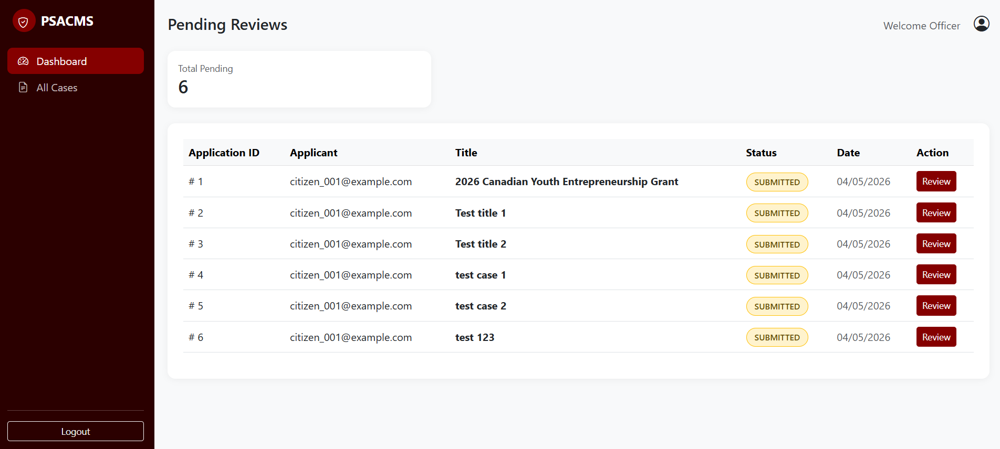
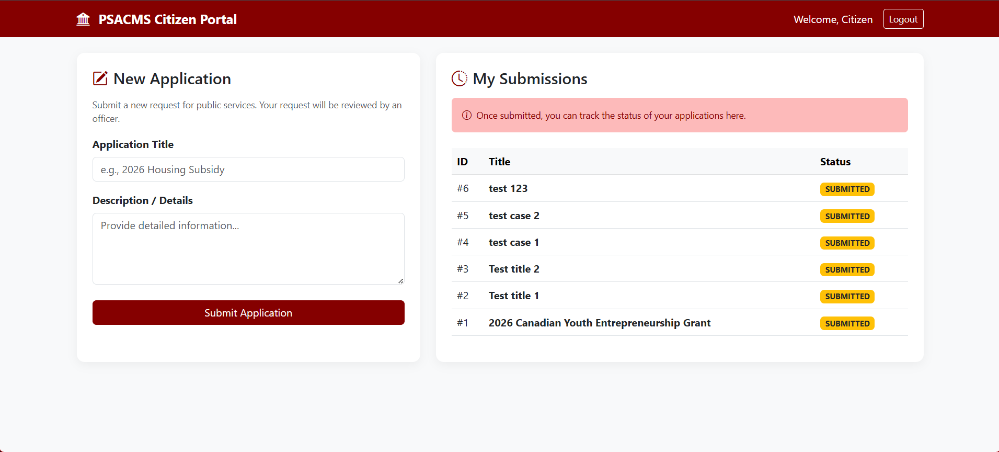

# PSACMS: Public Service Application & Case Management System

A secure, full-stack Public Service Case Management System designed to handle government-style workflows. Built with a decoupled architecture featuring a **Spring Boot RESTful API**, **Zero-Trust JWT authentication**, and a **Vanilla JS Single-Page Application (SPA)**.

## * Key Features & Architecture Highlights

- **Zero-Trust Security & RBAC:** Implemented stateless JSON Web Tokens (JWT) using Spring Security. Strictly separated endpoints and frontend routing for `CITIZEN` (submission) and `OFFICER` (review) roles.
- **Robust Workflow State Machine:** Engineered strict business logic to govern application status transitions (e.g., `SUBMITTED` ➔ `UNDER_REVIEW` ➔ `APPROVED`/`REJECTED`).
- **Immutable Audit Trail:** Designed an append-only database schema (`application_status_history`) to track historical state changes and actor identities, ensuring compliance and data integrity.
- **Graceful Error Handling:** Integrated a Global Exception Handler (`@ControllerAdvice`) to prevent stack trace leaks and return standardized RESTful JSON responses.
- **Decoupled SPA Frontend:** Built responsive officer and citizen portals using Vanilla JavaScript, Fetch API, and Bootstrap 5, successfully handling complex CORS configurations and preflight requests.

## * System Previews

### 1. Officer Portal (SPA)
> Real-time asynchronous data fetching with role-based routing.
> 
### 2. Citizen Application Portal
> Secure submission portal mapped to the Citizen JWT payload.
> 
## * Database Entity-Relationship (ER) Diagram

To ensure strict data integrity, the database is normalized and features a dedicated tracking table for audit purposes.

## * Getting Started (Local Development)

### Prerequisites
- Java 17+
- Maven
- MySQL / PostgreSQL

### Backend Setup
1. Clone the repository: `git clone https://github.com/your-username/psacms.git`
2. Update the `application.properties` with your database credentials.
3. Run the Spring Boot application: `./mvnw spring-boot:run`
4. The REST API will be available at `http://localhost:8080`.

### Frontend Setup

Since the frontend is a decoupled SPA, no Node.js or Webpack build step is required:

1. Navigate to the `/frontend` directory.
2. Open `index.html` directly in any modern web browser.
3. Login using the default test accounts (or register a new one).

## * Roadmap / Future Enhancements

- [ ] Deploy backend to Render/Railway and frontend to GitHub Pages.
- [ ] Implement pagination for the Officer Portal.
- [ ] Add PDF attachment upload functionality for citizen submissions.

---

_Designed and developed by Jay Chao. Feel free to connect with me on [LinkedIn](https://www.linkedin.com/in/ccjay/)._
